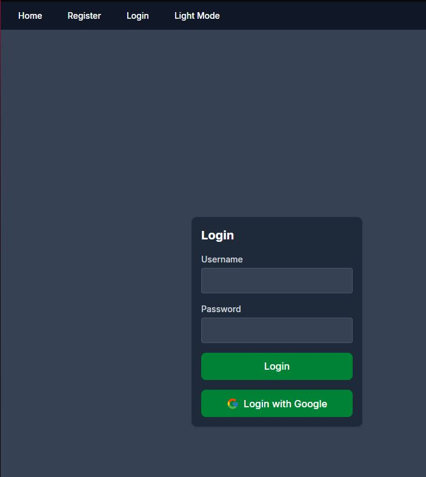
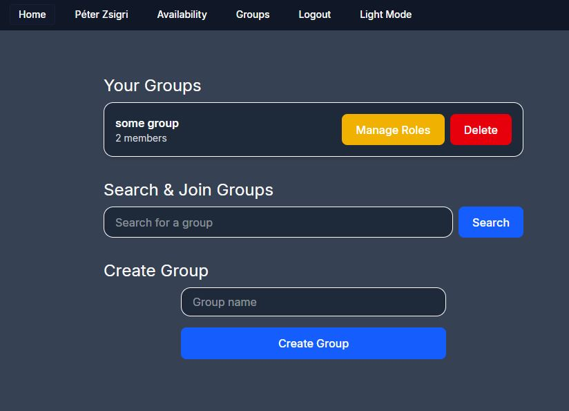
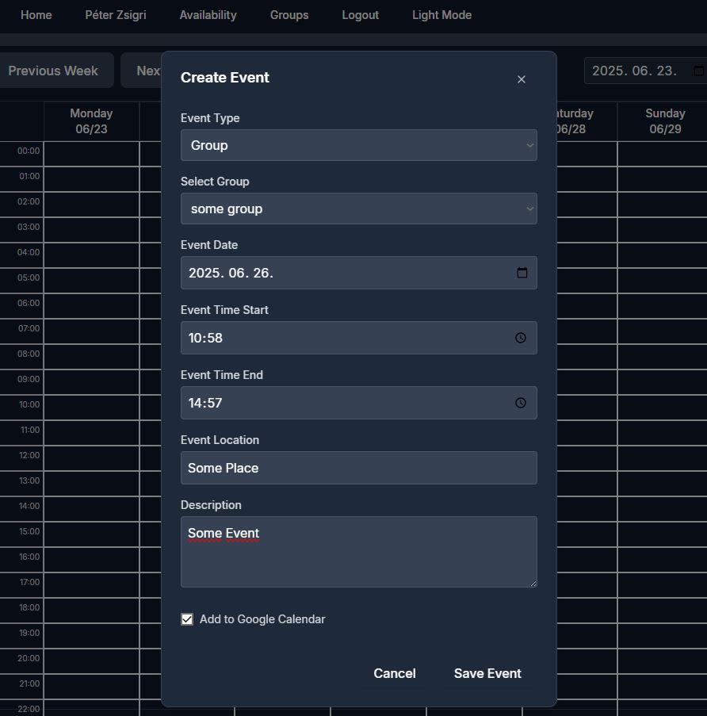
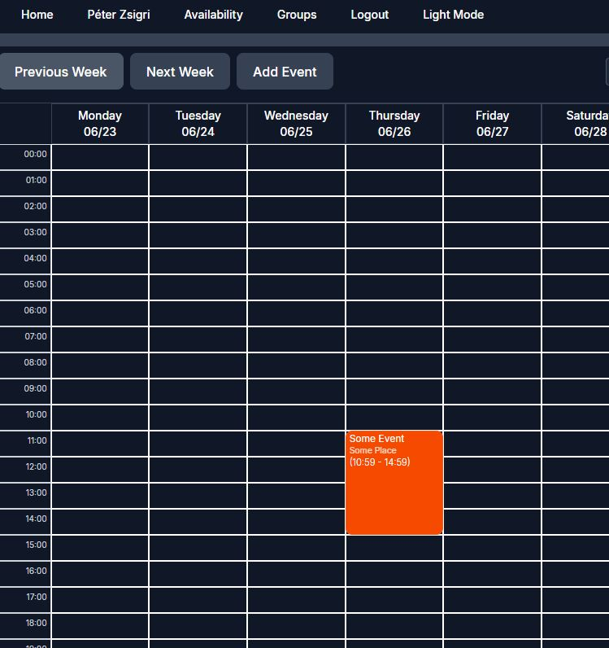
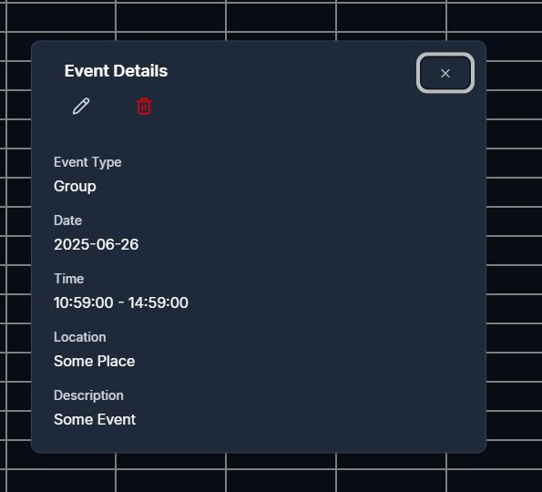
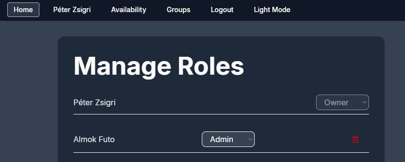

# Team-Availability-Calendar
A web application that allows groups to track and manage their events for different activities. It provides an intuitive interface where group members can indicate their available for events.

Key Features:
1. User Authentication & Profiles

2. Group Management 

Users can create, join groups.

3. Team Calendar View

Users can create group events if they have the role for it.

View details of existing events or edit them.

4. Events can be added to Google Calendar

5. Event Create, Edit, Delete for group events send email notification for the group members

6. Integration with External Calendars
Sync availability with Google Calendar.

7. Admin & Role Management
Admins can manage team members, approve schedule changes, and set meeting policies.

Different roles: Member (sets availability), Manager (suggests meetings), Admin (manages settings).

Dark mode support.

Mobile-friendly design.

## Technologies
- [![React]][React-url] [![Vite]][Vite-url] [![JavaScript]][JavaScript-url] [![TypeScript]][TypeScript-url]
- [![CSS]][CSS-url]
- [![Django]][Django-url] [![DRF]][DRF-url]
- [![JWT]][JWT-url]
- [![Postgres]][Postgres-url]
- [![Git]][Git-url]

### Installation
To set up the project locally:
- Clone to local machine
- .env example file has sample data that has to be modified and saved as .env, and a firebase_key.json has to be included in the same directory.
  - Navigate to root directory
  - `pip install -r requirements.txt`
  - `venv\Scripts\Activate.ps1`
  - `cd .\backend\`
  - `python manage.py runserver `
  - Open new cmd
  - Navigate to root directory
  - `cd .\frontend\`
  - `npm run dev`
  - Open link in browser

[Postgres]: https://img.shields.io/badge/Postgres-%23316192.svg?logo=postgresql&logoColor=white
[Postgres-url]: https://www.postgresql.org/

[Docker]: https://img.shields.io/badge/Docker-2496ED?logo=docker&logoColor=fff
[Docker-url]: https://www.docker.com/

[React]: https://img.shields.io/badge/React-%2320232a.svg?logo=react&logoColor=%2361DAFB
[React-url]: https://react.dev/

[Vite]: https://img.shields.io/badge/Vite-646CFF?logo=vite&logoColor=fff
[Vite-url]: https://vite.dev/guide/

[CSS]: https://img.shields.io/badge/CSS-1572B6?logo=css3&logoColor=fff
[CSS-url]: https://en.wikipedia.org/wiki/CSS

[JavaScript]: https://img.shields.io/badge/JavaScript-F7DF1E?logo=javascript&logoColor=000
[JavaScript-url]: https://en.wikipedia.org/wiki/JavaScript

[Git]: https://img.shields.io/badge/Git-F05032?logo=git&logoColor=fff
[Git-url]: https://git-scm.com/

[TypeScript]: https://img.shields.io/badge/TypeScript-blue?logo=typescript&logoColor=white
[TypeScript-url]: https://www.typescriptlang.org

[Django]: https://img.shields.io/badge/Django-092E20?logo=django&logoColor=white
[Django-url]: https://www.djangoproject.com

[DRF]: https://img.shields.io/badge/DRF-ff1709?logo=django&logoColor=white&label=DRF
[DRF-url]: https://www.django-rest-framework.org

[JWT]: https://img.shields.io/badge/JWT-000000?logo=jsonwebtokens&logoColor=white
[JWT-url]: https://jwt.io
